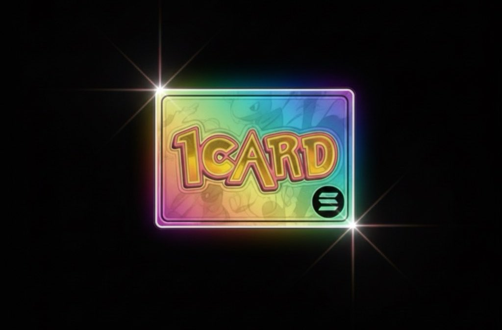

# 1Card

> **Gotta Copy 'Em All!** A Pokémon-themed copy-trading platform on Solana with $1CARD utility token.



## 🎮 What is 1Card?

1Card is a gamified, decentralized copy-trading ecosystem that transforms successful crypto traders into "Trainers" and their followers into "Acolytes." Built on Solana with modern Pokémon-inspired aesthetics, 1Card leverages the $1CARD token as the core utility driving staking, reputation, fees, and deflationary burns.

## ⚡ Core Features

### 🏋️ The 1Card Vault - Trainer Staking System

Traders stake $1CARD tokens to become verified "Trainers" with tiered status:

- **Tier 1: Basic Trainer** - Entry-level signal provider
- **Tier 2: Gym Leader** - Proven, reliable performance
- **Tier 3: Elite Four** - Top-performing traders with highest ROI

**Key Mechanics:**
- Higher stakes = Higher visibility + Larger fee share
- Reputation collateral system with performance-based slashing
- 30-day lockup period with 7-day withdrawal notice

### 💰 Copy-Acolyte Fee & Burn

Acolytes pay subscription fees in $1CARD to access real-time trade signals:

**Fee Distribution:**
- **40-60%** → Trainer Reward (varies by tier)
- **20%** → Permanent Token Burn 🔥
- **15%** → Poké Bank Treasury (Development Fund)
- **5%** → Acolyte Staking Rewards

### 🎯 Battle Arena Leaderboard

Competitive rankings based on verifiable on-chain metrics:
- 7-day ROI
- Total Copied Volume
- Max Drawdown
- Monthly prizes from the Poké Bank Treasury

## 🛠️ Tech Stack

- **Frontend:** Next.js 16, React 19, TypeScript
- **Styling:** Tailwind CSS v4 (Pixel Art aesthetic)
- **UI Components:** Radix UI, shadcn/ui
- **Blockchain:** Solana
- **Token:** $1CARD (Pump.fun launch)
- **Wallet Integration:** Solana Wallet Adapter

## 🚀 Quick Start

### Prerequisites

- Node.js 18+
- pnpm (recommended)
- A Solana wallet (Phantom, Solflare)

### Installation

```bash
# Clone the repository
git clone https://github.com/SmratJay/1card.git
cd 1card

# Install dependencies
pnpm install

# Run development server
pnpm dev
```

Open [http://localhost:3000](http://localhost:3000) to see the application.

### Build for Production

```bash
pnpm build
pnpm start
```

## 📁 Project Structure

```
1card/
├── app/                    # Next.js app directory
│   ├── layout.tsx         # Root layout with theme
│   ├── page.tsx           # Landing page
│   └── globals.css        # Global styles
├── components/            # React components
│   ├── header.tsx         # Navigation header
│   ├── hero-section.tsx   # Hero with CTA
│   ├── features-section.tsx
│   ├── trainers-carousel.tsx
│   ├── vault-cta.tsx
│   └── ui/                # shadcn/ui components
├── lib/                   # Utilities
│   └── utils.ts          # Class merger utilities
├── public/               # Static assets
│   └── images/           # Brand images
└── package.json          # Dependencies
```

## 🎨 Design Philosophy

**Simple. Crisp. Aesthetically Pleasing.**

- **16-bit Pixel Art** meets modern DeFi dashboard
- **Game Boy Advance** nostalgia with professional polish
- **Color Palette:** Deep Navy Blue, Bright Yellow/Gold, Clean White
- **Typography:** Blocky pixel fonts for headings, clean sans-serif for data
- **Borders:** 1-2px outlines reminiscent of Pokémon battle screens

## 🔐 Smart Contract Architecture (Beta)

### Phase 1: Core Token & Treasury
- $1CARD token deployed via Pump.fun
- Mint authority revoked for security
- Treasury wallet (Poké Bank) for ecosystem funding
- Burn wallet for deflationary mechanics

### Phase 2: The Vault Contract
- `registerTrainer(amount)` - Stake $1CARD and register
- `getTrainerTier(address)` - Check trainer status
- `initiateWithdrawal()` - 7-day cooldown mechanism
- Manual slashing (V1: DAO-governed)

### Phase 3: Subscription Payment Contract
- `paySubscription(trainer_address)` - Monthly fee payment
- Automatic distribution: Trainer → Burn → Treasury
- Access control for private signal channels

## 📊 Tokenomics

**$1CARD Utility:**
- ✅ Staking requirement for Trainer registration
- ✅ Subscription payment for copy-trading access
- ✅ Governance participation (V2)
- ✅ Performance fee payments
- ✅ Liquidity provision rewards

**Deflationary Mechanisms:**
- 20% of all subscription fees burned
- Evolution/Fusion burns (Future: NFT utility)
- Slashing penalties from underperforming Trainers

## 🗺️ Roadmap

### ✅ Phase 0 (Current) - Frontend Launch
- Modern, responsive landing page
- Pokémon pixel-art aesthetic
- Core UI/UX components
- Wallet connection ready

### 🔄 Phase 1 (Beta) - MVP Launch
- $1CARD token launch on Pump.fun
- Vault staking contract deployment
- Trainer registration system
- Basic leaderboard (off-chain tracking)

### 📅 Phase 2 - Copy-Trading Integration
- Subscription payment contract
- Private Telegram/Discord signal channels
- Manual trade signal distribution
- Fee distribution automation

### 🚀 Phase 3 - Advanced Features
- DAO governance for slashing decisions
- Automated copy-trading bot
- NFT "Trainer Card" system
- Safari Zone lottery & games
- Full on-chain performance tracking

## 🤝 Contributing

We're in beta and building rapidly! Contributions are welcome:

1. Fork the repository
2. Create a feature branch (`git checkout -b feature/amazing-feature`)
3. Commit your changes (`git commit -m 'Add amazing feature'`)
4. Push to the branch (`git push origin feature/amazing-feature`)
5. Open a Pull Request

## 📄 License

This project is private and proprietary during beta development.

## 🔗 Links

- **Website:** [Coming Soon]
- **Twitter:** [Coming Soon]
- **Discord:** [Coming Soon]
- **Telegram:** [Coming Soon]

## 💡 Vision

1Card transforms the complex world of crypto copy-trading into an accessible, gamified experience. By combining the nostalgic appeal of Pokémon with cutting-edge DeFi mechanics, we're building a platform where:

- **Traders** are incentivized to perform through reputation staking
- **Followers** gain access to proven strategies with transparent fees
- **Token holders** benefit from continuous deflationary pressure
- **The community** governs platform decisions and trainer accountability

---

**Built with ❤️ by a one-man team. Powered by $1CARD on Solana.**

*Gotta Copy 'Em All!* 🃏⚡
